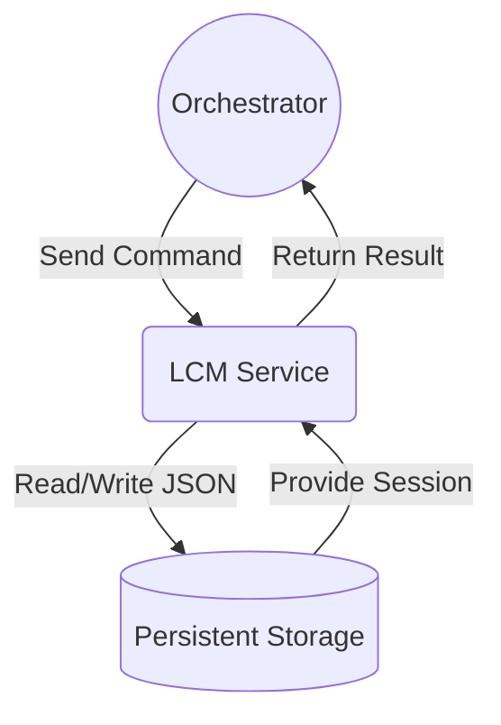

# Lilith Context Manager

<div align="center">

[](https://opensource.org/licenses/Apache-2.0)
[](#)
[](https://discord.gg/msxrpayZvB)
[](#)
[](https://github.com/psf/black)

A standalone, non-intelligent service for advanced conversation state management in AI systems, built for the Lilith AI assistant ecosystem.

</div>

---

**Lilith-Context-Manager** is a service-oriented module designed to track the state and structure of conversations without interpreting their content.  It provides a robust, "Tree-inspired" conversation tracking system that allows for complex, long-running dialogues with features like branching, context compression, and dynamic context windows. 


## ✨ Key Features

**🧠 Zero-Intelligence State Tracking**: The context-manager is a non-intelligent state tracker. It manages session data based on explicit commands and does not perform any analysis or make independent decisions. 

**🌳 Tree-Style Conversation History**: Models conversation history as a branching graph, allowing for tangents, merges, and exploration of different conversational paths. 

**📜 Automatic Context Compression**: Automatically compresses older parts of a conversation into concise summaries while keeping the most recent exchanges verbatim, ensuring a natural flow and preventing token overflow. 

**📦 Service-Oriented Architecture**: Runs as a persistent, standalone FastAPI service, ensuring a clean separation of concerns and allowing it to be developed and scaled independently. 

**🛡️ Robust Persistence & Data Integrity**: Active sessions are persisted to the filesystem as discrete JSON objects using atomic write operations to prevent data corruption, even in the event of a crash. 

**🤝 Strict Data Contracts**: All data transfer is validated against a canonical schema using Pydantic, eliminating data-related errors and ensuring system-wide consistency. 


## 🏛️ Architectural Philosophy

The Lilith Context Manager is a foundational component of the broader Lilith AI ecosystem. Its design is governed by a strict "separation of concerns" principle. 

1.  **The context-manager is a specialized tool, not a brain.** It is responsible only for managing the *structure* of a conversation.  All intelligence, decision-making, and interpretation of content are handled by its primary consumer, the `lilith-orchestrator`. 
2.  **Communication is explicit.** The context manager operates on a command-based interaction model.  The Orchestrator issues direct commands to the context manager (e.g., start session, add turn, get context), and the context manager executes them according to its predefined rules. 
3.  **Data integrity is paramount.** The use of atomic writes and strict Pydantic data models guarantees that the state of a conversation is never corrupted and that all components speak the same language. 

This architecture ensures that the context manager is a reliable, reusable, and highly focused piece of infrastructure that can be used in any AI project that requires sophisticated context management.





## 🚀 Getting Started

> **Note**: This project is currently under heavy development. The service and client library are not yet packaged for public consumption. The following sections are placeholders for when the project reaches a more stable state.


### Prerequisites

* Python 3.10+
* An understanding of REST APIs and service-oriented architecture.


### Installation

```bash
# This is a placeholder. The package is not yet available.
pip install lilith-context-manager
```


🤝 Contributing

We welcome contributions from the community! This project is in its early stages, and there are many opportunities to get involved, from writing code and improving documentation to reporting bugs and suggesting features.

Before you begin, please read our [contribution guidelines](./.github/CONTRIBUTING.md).

We also have a Code of Conduct to ensure our community is welcoming and inclusive for everyone.

[THE CODE](./.github/CODE_OF_CONDUCT.md)


📜 License

This project is licensed under the Apache 2.0 License. See the LICENSE file for details.


🙏 Acknowledgements

The design and architecture of this project are the result of extensive planning and collaboration. Thank you to everyone who has contributed their ideas and expertise to the Lilith ecosystem.
